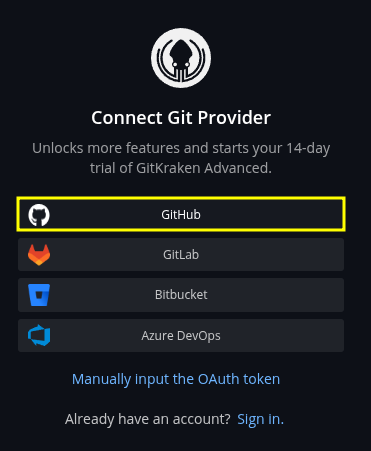
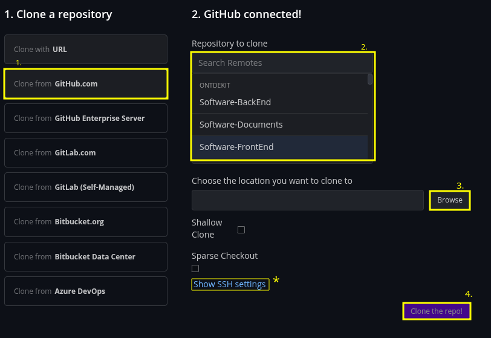
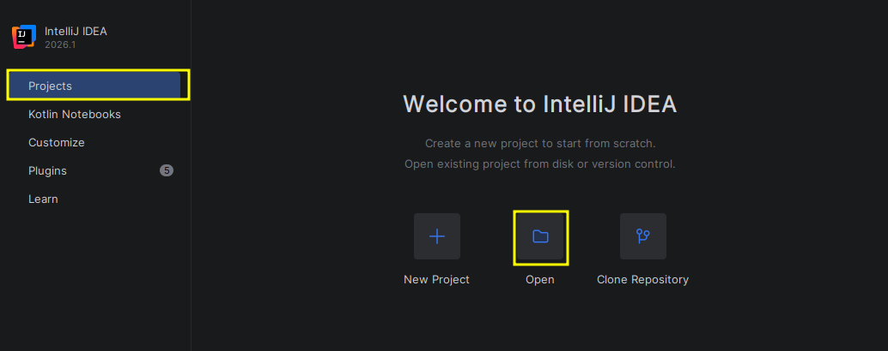
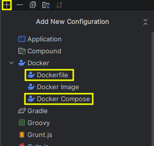
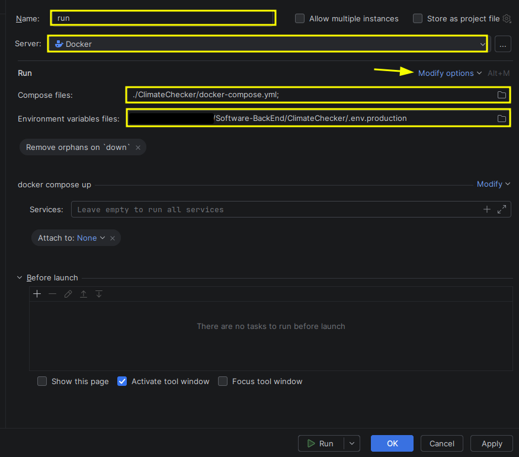
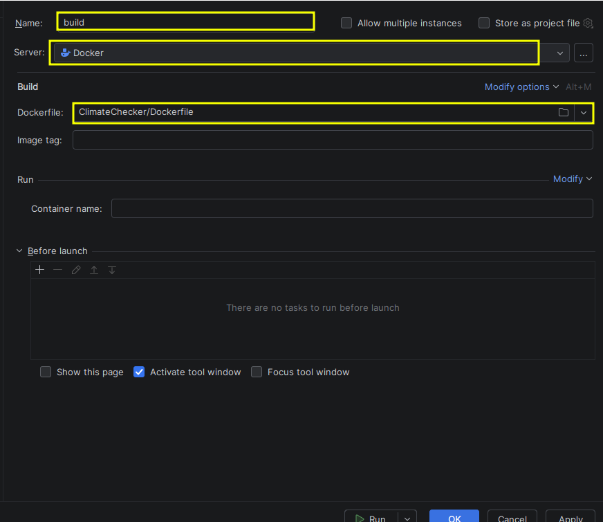
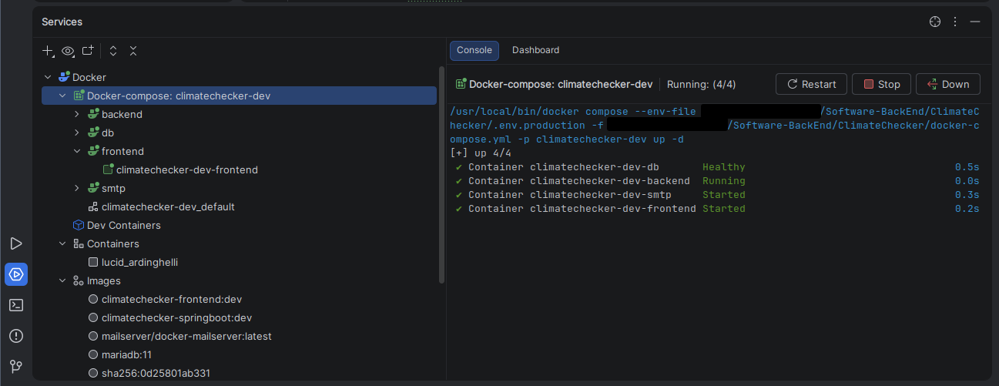

# Getting started

> Deze pagina helpt je stap voor stap bij het opzetten van de ontwikkelomgeving en het installeren van alle benodigde software om het project lokaal te draaien.

---

## 1. Overzicht

Dit document zal in zekere zin uitleggen hoe je het project werkend kunt krijgen. Net als in het leven zijn er meerdere wegen die naar Rome leiden, en ook hier zullen we verschillende werkmethodes toepassen.

>Er is echter wel een eenvoudigere methode die algemeen gebruikt kan worden, al verschilt dit per persoon. Bij elke manier zal uitleg worden gegeven, zodat je de juiste beslissing kunt maken voor het uiteindelijke doel.

---

## 2. Vereisten software

Wat nodig is voordat je begint:

- **GIT**: Dit kan een git client zijn (bijvoorbeeld GitKraken, Github Desktop) of via de CLI.
- **Java JDK**: De vereiste versie is momenteel JDK 21.
- **Node.JS**: De algemene versie van Node.js.
- **Docker**: Dit kan Docker desktop zijn of DockeCLI (ben wel bewust van  dat Docker compose dan noodzakelijk is).
- **IDEA**: Dit is personal preferences, maar Intelij IDEA is momenteel gratis voor Fontys-studenten. als je een eigen idea gebruikt moet deze wel de mogelijkheid hebben om docker te start/stoppen en breakpoints.

---

## 3. Installatie

### 3.1 Installatie met PowerShell

Wil je nu snel en gemakkelijk de vereisten software op je laptop hebben, dan kan dit met een klein powershell script.  

> Deze commands zullen de volgende software installeren: Java JDK 21, Node.js en Docker Deskptop

**LET OP! Zorg dan WSL2 werkt en lees voordat je invoert.**

```powershell
# Run PowerShell as Administrator
# Update winget
winget upgrade --all --accept-package-agreements --accept-source-agreements

# Install Java JDK 21
winget install -e --id EclipseAdoptium.Temurin.21.JDK --accept-package-agreements --accept-source-agreements

# Install Node.js (LTS)
winget install -e --id OpenJS.NodeJS.LTS --accept-package-agreements --accept-source-agreements

# Install Docker Desktop
winget install -e --id Docker.DockerDesktop --accept-package-agreements --accept-source-agreements
```

#### 3.1.1 IntelliJ IDEA en GitKraken Desktop installeren

Wil je ook de standaard IntelliJ IDEA en GitKraken Desktop installeren? Gebruik dan onderstaande stappen.

> **Let op:** De standaard editie van JetBrains IntelliJ IDEA is de *Community Edition*.
> Dit kun je aanpassen door een andere variant te kiezen, zoals:
>
> * `.Ultimate`
> * `.Edu`

```powershell
# Run PowerShell as Administrator
# Install IntelliJ IDEA 
winget install -e --id JetBrains.IntelliJIDEA.Community --accept-package-agreements --accept-source-agreements


# Install GitKraken Desktop 
winget install -e --id Axosoft.GitKraken --accept-package-agreements --accept-source-agreements
```

### 3.2 Installatie met linkjes

Hier kun je de link(s) vinden naar de desbetreffende installatieprogramma’s. **Let wel op**: er is geprobeerd te linken naar de daadwerkelijke versie van de software, maar dit is niet bij elke website even gemakkelijk.

- [Java JDK 21](https://www.oracle.com/nl/java/technologies/downloads/#java21)  
- [Node.js](https://nodejs.org/en/download/current)  
- [Docker desktop](https://docs.docker.com/desktop/setup/install/windows-install/)  
- [Github desktop](https://desktop.github.com/download/)  
- [Intellij IDEA](https://www.jetbrains.com/idea/download/?section=linux)  

### 3.3 Environment variables

De backend maakt gebruik van een environment variables bestand (`.env`) voor het configureren van instellingen zoals databaseverbindingen en API-sleutels.

Je kunt de benodigde bestanden hieronder downloaden:

- [Development environment](../environment/.env.development)  
- [Production environment](../environment/.env.production)

---

## 4. Configuratie & koppeling

De setup maakt gebruik van de [installatie met linkjes](#32-installatie-met-linkjes), maar kan natuurlijk ook volledig worden gevolgd via de [PowerShell-setup](#31-installatie-met-powershell).  

Tot slot wordt er ook uitgelegd hoe je alle onderdelen met elkaar verbindt, zodat [de volledige omgeving correct functioneert](#42-koppeling).

### 4.1 Configuratie-opties

In deze sectie worden de verschillende configuratie- en uitvoeringsopties van de applicatie beschreven. De applicatie kan op meerdere manieren worden ingesteld en uitgevoerd. Elke methode wordt hieronder stap voor stap uitgelegd, inclusief screenshots waar nodig.

> De **aanbevolen** manier om de applicatie te configureren is via [IntelliJ IDEA configuratie](#415-configuratie-voor-docker-via-intellij-idea).

Daarnaast kan de applicatie ook worden uitgevoerd via *GitKraken* of *Docker Desktop*. Deze methoden zijn vooral bedoeld als alternatieve of **eindgebruikersopties** wanneer je niet via IntelliJ werkt.

### 4.2 Repositories met gitkraken

<table border="0">

<!-- ################ STAP 1 ################ -->

  <tr>
    <td colspan="2" style="border: 0; font-weight: bold; padding-bottom: 10px;">
      <b>STAP 1</b>
    </td>
  </tr>

  <tr>
    <td style="border: 0; padding-right: 20px;">
      Open GitKraken Desktop en log in met je GitHub-account. Kies hierbij voor GitHub, aangezien het project daarop gehost wordt.<br><br>
      Navigeer vervolgens naar “Clone repository” en selecteer deze optie.
    </td>
    <td style="border: 0;">
      
    </td>
  </tr>

  <!-- ################ STAP 2 ################ -->

  <tr>
    <td colspan="2" style="border: 0; font-weight: bold; padding-bottom: 10px;">
      <b>STAP 2</b>
    </td>
  </tr>

  <tr>
    <td style="border: 0; padding-right: 20px;">
<ol>
  <li>Open GitKraken en ga naar <b>“Clone a repository”</b>.</li>

  <li>Selecteer <b>GitHub</b> als bron en log indien nodig in.</li>

  <li>Kies de juiste repository:
    <ul>
      <li>Front-end repository</li>
      <li>Back-end repository</li>
      <li>Documents repository</li>
    </ul>
  </li>

  <li>Selecteer de gewenste lokale installatie map (local path).</li>

  <li>
    <b>Optioneel (SSH):</b>  
    Alleen nodig als je werkt met SSH-keys in plaats van HTTPS.
  </li>

  <li>Klik op <b>“Clone”</b> om de repository lokaal te downloaden.</li>
</ol>
    </td>
    <td style="border: 0;">
      
    </td>
  </tr>
</table>

### 4.2 Configuratie Docker desktop

> TODO!

### 4.3 Configuratie frondend alleen met Node.js

Node.js is eenvoudig te installeren en wordt binnen dit project gebruikt om de frondend te draaien.

> De benodigde dependencies worden beheerd via `package.json`, waarmee alle npm-packages in één keer geïnstalleerd kunnen worden.

> Zie de officiële handleiding voor installatie: [Node.js installatiegids](https://nodejs.org/en/download/current).
```bash
npm install
npm run dev
```

### 4.4 Setup Java JDK

Voor dit project is [Java JDK 21](https://www.oracle.com/nl/java/technologies/downloads/#java21) vereist. Zorg ervoor dat deze versie correct is geïnstalleerd voordat je het project opstart.

> Het project maakt gebruik van Maven voor dependency management en build automation. Alle benodigde dependencies worden beheerd via het `pom.xml`-bestand.

##### 4.4.1 Docker Compose en Java

Wanneer je het project via Docker Compose opstart, wordt automatisch een `mvn clean install` uitgevoerd.

Werk je echter zonder Docker (bijvoorbeeld direct met de broncode), dan moet je dit commando handmatig uitvoeren:

```bash
mvn clean install
```

#### 4.1.5 Configuratie voor docker via Intelij IDEA

> **Let op:** Werk je met een IDE (bijvoorbeeld IntelliJ IDEA), dan worden Docker en het `docker-compose`-bestand automatisch gebruikt om het project op te starten.  
> Je kunt het project in dat geval volledig vanuit de IDE benaderen.  
>  
> Dit betekent dat de volgende vijf services automatisch worden gestart via Docker:
> - Backend  
> - Frontend  
> - Database  
> - Mailserver  
> - Maven
>
> Voor meer informatie zie `docker` en `docker-compose`-bestanden.

<table border="0">

  <!-- ################ STAP 1 ################ -->

  <tr>
    <td colspan="2" style="border: 0; font-weight: bold; padding-bottom: 10px;">
      <b>STAP 1</b>
    </td>
  </tr>

  <tr>
    <td style="border: 0; padding-right: 20px;">
    <ol>
      <li>Start IntelliJ IDEA.</li>
      <li>Ga naar het startscherm en klik op <b>Open</b>.</li>
      <li style="color:#e96d08;"><b>Let op</b>: Als je de repository nog niet hebt gekloond, kun je dat nu doen.</li>
      <li>Selecteer de repository <b>Software-BackEnd</b>.</li>
    </ol>
    </td>
    <td style="border: 0;">
      
    </td>
  </tr>

  <!-- ################ STAP 2 ################ -->

  <tr>
    <td colspan="2" style="border: 0; font-weight: bold; padding-bottom: 10px;">
      <b>STAP 3</b>
    </td>
  </tr>

  <tr>
    <td style="border: 0; padding-right: 20px;">
    <ol>
      <li>Maak een nieuwe Run/Debug Configuration aan.</li>
      <li>Selecteer een van de volgende opties (beide moeten uiteindelijk worden ingesteld):
        <ul>
          <li><b>Dockerfile:</b> ga naar de stap <i>Run config</i>.</li>
          <li><b>Docker Compose:</b> ga naar de stap <i>Build config</i>.</li>
        </ul>
      </li>
    </ol>
    </td>
    <td style="border: 0;">
      
    </td>
  </tr>
    <!-- ################ STAP RUN ################ -->
  <tr>
    <td colspan="2" style="border: 0; font-weight: bold; padding-bottom: 10px;">
      <b>STAP "RUN" CONFIG</b>
    </td>
  </tr>

  <tr>
    <td style="border: 0; padding-right: 20px;">
    <ol>
      <li>Maak een nieuwe Run/Debug Configuration aan.</li>
    </ol>
    </td>
    <td style="border: 0;">
      
    </td>
  </tr>
      <!-- ################ STAP BUILD ################ -->
  <tr>
    <td colspan="2" style="border: 0; font-weight: bold; padding-bottom: 10px;">
      <b>STAP "BUILD" CONFIG</b>
    </td>
  </tr>

  <tr>
    <td style="border: 0; padding-right: 20px;">
    <ol>
      <li>Maak een nieuwe Run/Debug Configuration aan.</li>
    </ol>
    </td>
    <td style="border: 0;">
      
    </td>
  </tr>

  <!-- ################ OVERVIEW SERVICES ################ -->

  <tr>
    <td colspan="2" style="border: 0; font-weight: bold; padding-bottom: 10px;">
      <b>OVERVIEW SERVICES</b>
    </td>
  </tr>

  <tr>
    <td style="border: 0; padding-right: 20px;">
    <ol>
      <li>Maak een nieuwe Run/Debug Configuration aan.</li>
    </ol>
    </td>
    <td style="border: 0;">
      
    </td>
  </tr>
</table>

### 4.2 koppeling

> TODO!